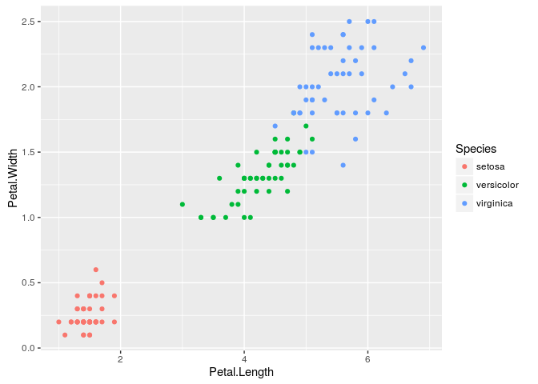
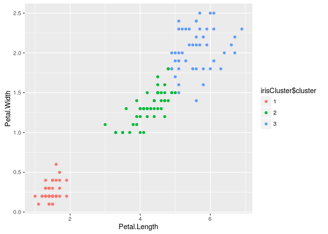

# Iris dataset clustering using R
Alan Zablocki  
August 3, 2016  


## R Markdown

This is an R Markdown document. Markdown is a simple formatting syntax for authoring HTML, PDF, and MS Word documents. For more details on using R Markdown see <http://rmarkdown.rstudio.com>.

```
Load required libraries
```


```r
library(datasets)
library(ggplot2)
```

```
Select iris dataset
```

```r
data(iris)
head(iris)
```

```
##   Sepal.Length Sepal.Width Petal.Length Petal.Width Species
## 1          5.1         3.5          1.4         0.2  setosa
## 2          4.9         3.0          1.4         0.2  setosa
## 3          4.7         3.2          1.3         0.2  setosa
## 4          4.6         3.1          1.5         0.2  setosa
## 5          5.0         3.6          1.4         0.2  setosa
## 6          5.4         3.9          1.7         0.4  setosa
```

<!-- -->


```r
set.seed(20)
irisCluster <- kmeans(iris[, 3:4], 3, nstart = 20)
irisCluster
```

```
## K-means clustering with 3 clusters of sizes 50, 52, 48
## 
## Cluster means:
##   Petal.Length Petal.Width
## 1     1.462000    0.246000
## 2     4.269231    1.342308
## 3     5.595833    2.037500
## 
## Clustering vector:
##   [1] 1 1 1 1 1 1 1 1 1 1 1 1 1 1 1 1 1 1 1 1 1 1 1 1 1 1 1 1 1 1 1 1 1 1 1
##  [36] 1 1 1 1 1 1 1 1 1 1 1 1 1 1 1 2 2 2 2 2 2 2 2 2 2 2 2 2 2 2 2 2 2 2 2
##  [71] 2 2 2 2 2 2 2 3 2 2 2 2 2 3 2 2 2 2 2 2 2 2 2 2 2 2 2 2 2 2 3 3 3 3 3
## [106] 3 2 3 3 3 3 3 3 3 3 3 3 3 3 2 3 3 3 3 3 3 2 3 3 3 3 3 3 3 3 3 3 3 2 3
## [141] 3 3 3 3 3 3 3 3 3 3
## 
## Within cluster sum of squares by cluster:
## [1]  2.02200 13.05769 16.29167
##  (between_SS / total_SS =  94.3 %)
## 
## Available components:
## 
## [1] "cluster"      "centers"      "totss"        "withinss"    
## [5] "tot.withinss" "betweenss"    "size"         "iter"        
## [9] "ifault"
```


```r
table(irisCluster$cluster, iris$Species)
```

```
##    
##     setosa versicolor virginica
##   1     50          0         0
##   2      0         48         4
##   3      0          2        46
```


```r
irisCluster$cluster <- as.factor(irisCluster$cluster)
```

<!-- -->

